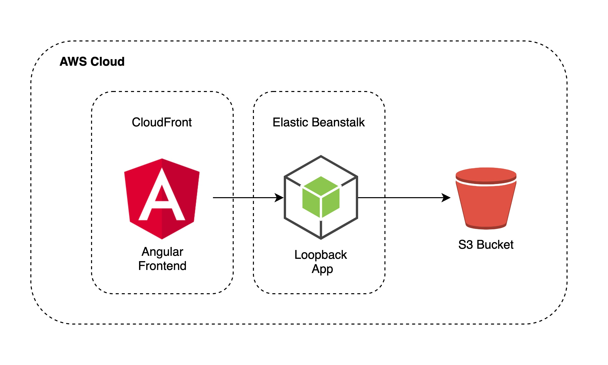
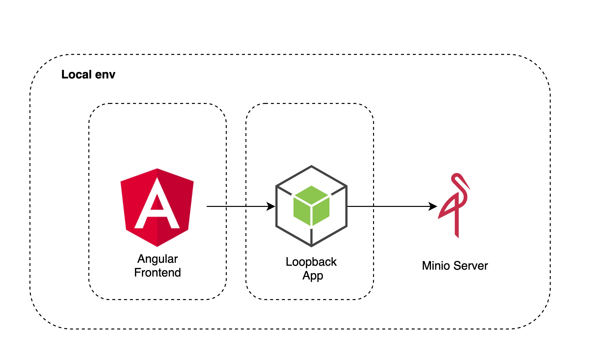

# Upload a file to S3 with a Loopback Application and using Minio to work locally.

The main goal of this project is to show a example of how to upload files to S3 at Cloud and how to work develop locally with minio.

- AWS S3 Bucket.
- Loopback Framework
-   Minio

## What are we going to build?

### Cloud Env

### Local Env

You can check more information in my post at [Medium](https://medium.com/@ricardo_fideles/upload-a-file-to-s3-with-a-loopback-application-and-using-minio-to-work-locally-96d7800b4c2c).

### Dependencies

1. loopback-connector-mongodb
2. aws-sdk
3. multiparty

The project is generated by [LoopBack](http://loopback.io).
